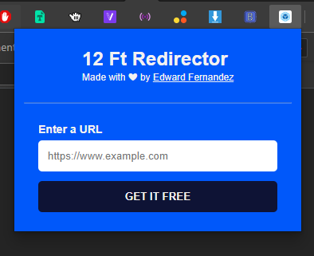

# 12ft Redirector Chrome Extension

12ft Redirector is a Chrome Extension that will automatically redirect user defined paywall domains to use 12ft.io.

- remove
  - paywalls
  - banner ads
  - and other popups your favorite websites.

## On development phase...



## Installation:

1.  **Download** or **Clone this repo**.
2.  Open a terminal and go to **repo's root** directory.
3.  Install the packages.

```terminal
$ npm install or yarn
```

## Follow me:

- Facebook Page: [constWardtz](https://fb.com/constWardtz)
- Facebook Group: [Const Programming Community](https://fb.com/groups/constprogrammingcommunity)

## Personal Socials:

- Facebook: [wardvisual](https://fb.com/wardvisual)
